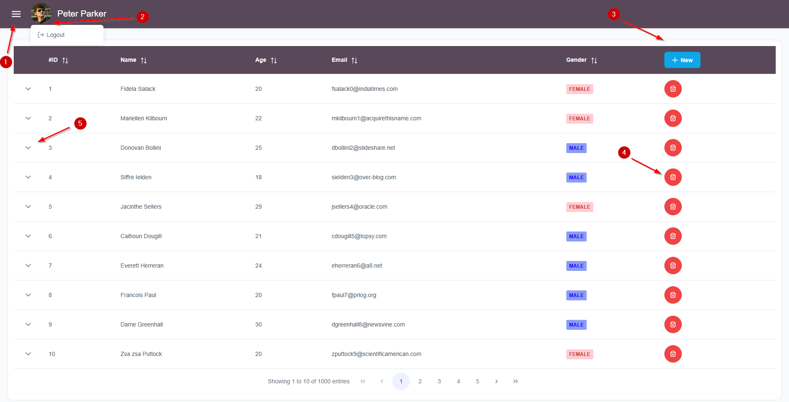

# Student Information System (SIS)

This Angular project implements a simple **Student Information System** using PrimeNG components. The application allows users to manage student data efficiently through the following features:

- **Add New Student**: Users can input basic student information and assign courses to the student.
- **Edit Student**: Users can modify the courses assigned to a student.
- **Delete Student**: Users can remove a student from the system.
- **Student Overview Page**: Displays students in a paginated table.

**Login with any username & password.**

###### 1. Toggle sidebar menu
###### 2. Image click will open menu with Logout option
###### 3. Add new student
###### 4. Delete student

This project is based on PrimeNG [Sakai template](https://github.com/primefaces/sakai-ng) v. ~17.0.0.
Mock data was generated using [www.mockaroo.com](https://www.mockaroo.com/).

## Prerequisites

Before setting up the project, ensure the following software is installed on the machine:

- **Node.js** (version 20.15.0 or later) - [Download Node.js](https://nodejs.org/)
- **Angular CLI** (version 18.0.7 or later) - Install via `npm install -g @angular/cli`

## Getting Started

Follow these steps to get the project running locally:

##### 1. Clone repo

##### 2. Navigate to project directory and install required dependencies with
` npm install `

##### 3. Run the application (development environment)
` ng serve `

##### 4. Open your web browser and navigate to http://localhost:4200/

## Running unit tests

Run `ng test` to execute the unit tests via [Karma](https://karma-runner.github.io).

## Further help

To get more help on the Angular CLI use `ng help` or go check out the [Angular CLI Overview and Command Reference](https://angular.dev/tools/cli) page.